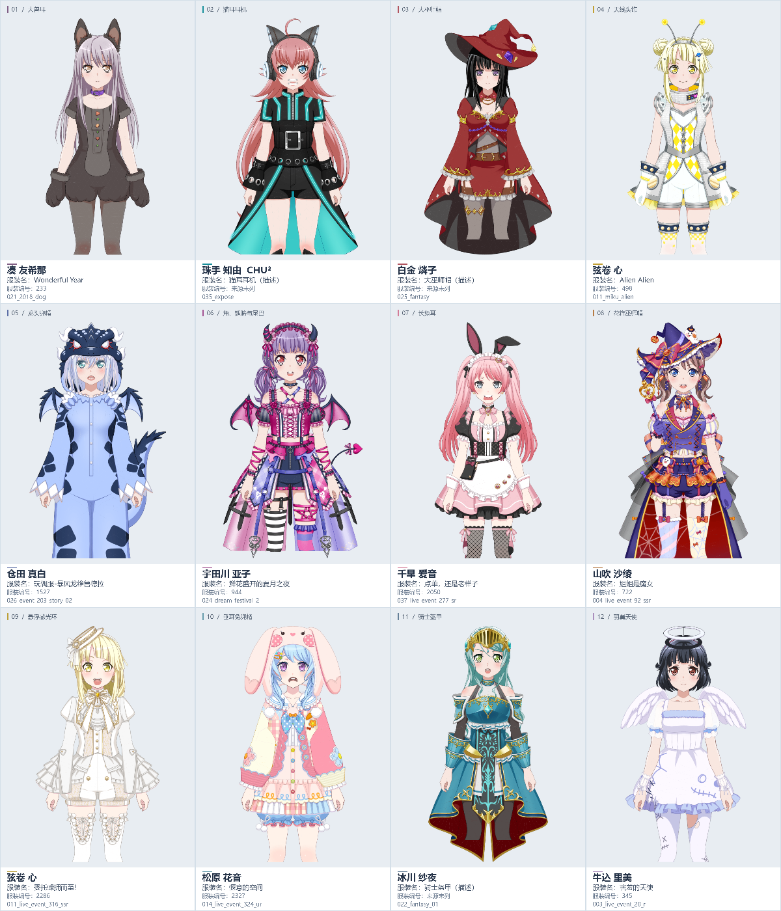

# 12套特殊服装 · 4列×3行图鉴

面向直接阅读的规整静态图鉴：**4列×3行、3600×4200**。保留此前六套特殊造型，加入四套备选以及骑士盔甲、羽翼天使。每格上方为立绘，下方简列角色、服装名、来源服装编号及资源标识。按行从左向右阅读，01—04、05—08、09—12。

- [查看完整4×3图鉴PNG](special-costumes-4x3.png)；[直接下载原尺寸PNG](https://github.com/Mikazuki-kufgr/webgal-attachment/raw/refs/heads/main/docs/reference/bangdream-model-parts/special-costumes/special-costumes-4x3.png)。
- [下载离线图鉴网页ZIP](https://github.com/Mikazuki-kufgr/webgal-attachment/raw/refs/heads/main/docs/reference/bangdream-model-parts/special-costumes/offline-page.zip)，解压双击index.html；支持整图适应宽度/原尺寸放大和PNG下载，不需服务器或网络。GitHub HTML文件页显示源码。
- [精选JSON](selection.json)、[CSV](selection.csv)。

## 服装清单

| 序号 | 角色 | 服装编号 | 服装名称 | 特殊造型 | 资源标识 |
|---|---|---|---|---|---|
| 1 | 凑 友希那 | 233 | Wonderful Year | 大兽耳 | `021_2018_dog` |
| 2 | 珠手 知由（CHU²） | 来源未列 | 猫耳耳机（造型描述） | 猫耳耳机 | `035_expose` |
| 3 | 白金 燐子 | 来源未列 | 大巫师帽（造型描述） | 大巫师帽 | `025_fantasy` |
| 4 | 弦卷 心 | 498 | Alien Alien | 天线头饰 | `011_miku_alien` |
| 5 | 仓田 真白 | 1527 | 玩偶服-暴风龙维鲁德拉 | 龙头兜帽 | `026_event_203_story_02` |
| 6 | 宇田川 亚子 | 944 | 鲜花盛开的夏月之夜 | 角、翅膀与尾巴 | `024_dream_festival_2` |
| 7 | 千早 爱音 | 2050 | 点单，还是老样子 | 长兔耳 | `037_live_event_277_sr` |
| 8 | 山吹 沙绫 | 722 | 姐姐是魔女 | 花饰巫师帽 | `004_live_event_92_ssr` |
| 9 | 弦卷 心 | 2286 | 委托蜂拥而至！ | 悬浮感光环 | `011_live_event_316_ssr` |
| 10 | 松原 花音 | 2327 | 惬意的空间 | 垂耳兔兜帽 | `014_live_event_324_ur` |
| 11 | 冰川 纱夜 | 来源未列 | 骑士盔甲（造型描述） | 骑士盔甲 | `022_fantasy_01` |
| 12 | 牛込 里美 | 345 | 害羞的天使 | 羽翼天使 | `003_live_event_20_r` |

## 来源、命名与边界

整理于2026-10-10；复用2026-10-02 Bestdori模型库、人物/服装元数据与3737入口静态审查。原六套/四备选保持身份，本轮定向复核追加纱夜022_fantasy_01与里美003_live_event_20_r。来源入口：[Bestdori日服Live2D资源索引](https://bestdori.com/tool/explorer/asset/jp/live2d/chara)，按资源标识定位。这是精选示例，不是全库唯一或最新服装清单。

服装编号为来源costumes元数据条目ID，不等于人物编号、卡片ID、图片序号或目录前缀。9套有编号，3套来源未列。名称保留来源快照文字；缺名以“（造型描述）”标明，不猜官方名。CHU²角色编号为35；资源标识区分具体外观。

图片为原模型几何/贴图的离线中性静态示意；本轮仅针对12套提高渲染分辨率与排版，未修改原模型，未补画资源本身没有的部位。不是完整游戏截图；全部clip/blend、物理、动作及可拆网格/移植效果未验证。第三方角色/服装/图像权利归原权利人，不适用本仓库独立代码/样例PNG许可，不授予源模型再分发权。

这是独立社区参考资料，只含派生静态图、网页与元数据，不含源模型、原贴图、动作、SDK或本机路径；不改变插件、公测tag、Release或安装资产。视频滚动用的横长图由制作者本地使用，不作为此公开图鉴文件发布。
